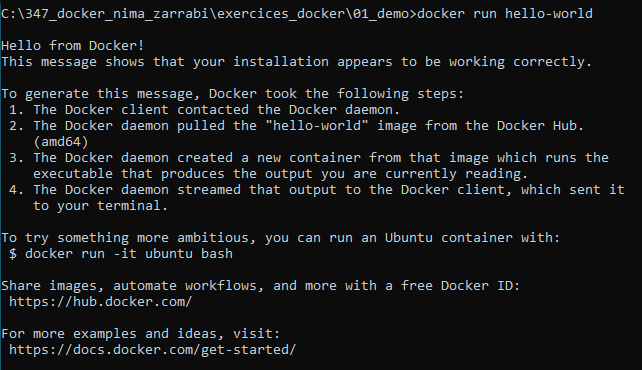
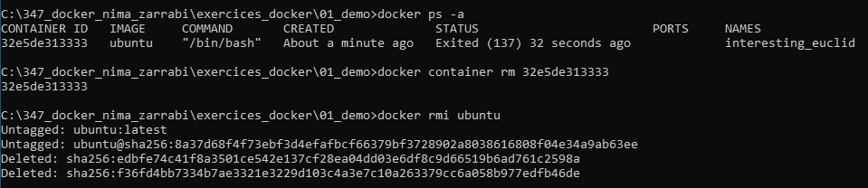

# Support de cours - Docker

P_Docker 347 - Nima Zarrabi - CID3A

Check Docker version¨

Log in Docker

Pull image

Run from image

List containers

List image

Stop specific image

Stop and remove container

List container ID

Erased all unused data

Erase all data

Stop andremove container interactive

Run from image

Run from image

Run from image

Run from image

Run from image

Run from image

Run from image

DTI 

d = detachable

T = 

I = interactive

docker rm for remove

cat = read file

-y pour "yes" par défault

nano = editeur de text

exec execute depuis la root de la machine

--force pour TOUT erase

myql 3306:3306
port itnerieur / exterieur