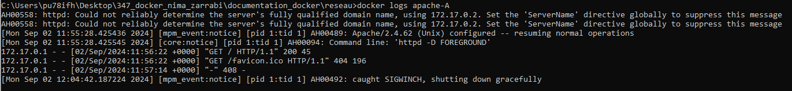

# Support de cours - Docker

P_Docker 347 - Nima Zarrabi - CID3A

# Introduction

Check Docker version¨

Log in Docker

Pull image

Run from image

List containers

List image

Stop specific image

Stop and remove container

List container ID

Erased all unused data

Erase all data

Stop andremove container interactive

Stop specif

update

apt update

apt update from cmd

upgrade

apt upgrade

apt upgrade from cmd

check ubuntu name

list releases from ubuntu terminal

go in ubuntu bash

executer une commande ubuntu directement 

et finalement, pour quitter ubuntu

Installer une app dans ubuntu

Installer un zip dans ubuntu depuis le cmd

List les fichiers dans ubuntu

List des fichiers specifics dans ubuntu

Transferer un fichier zip à ubuntu

DTI 

d = detachable

T = 

I = interactive

docker rm for remove

cat = read file

-y pour "yes" par défault

nano = editeur de text

exec execute depuis la root de la machine

--force pour TOUT erase

myql 3306:3306
port itnerieur / exterieur

# Volumes

Bind volumes

Named volumes
permet la pérsistance des données

peut être "shared" pour être accèdés par plusieurs containers

peut être un "volume docker" qui est gérés par Docker
pour les données que l'ont va jamais toucher

sinion mettre volume dans l'oridnateur avec a "shared" volume, pour pouvoir les modifier

crée volume :

docker run -e MYSQL_ROOT_PASSWORD=psw1333 --name mysql-A -d -p 3306:3306 --volume=C:/data/db_data:/var/lib/mysql mysql

PAS OUBLIER DE SE LOGIN

Crée une db

mettre une table

insérer une donnée

Lecture d'une donnée dans la base de données

quitter le container

lancer un nouveau container mysql-B

vérifier que les données sont dans ce container aussi

# reseau: docker

application (ex: wordpress) à besoin d'une connexion et aussi besoin de communiquer à un service (ex: databaser)

BRIDGE
machine Window
autour du Docker engine
autour du Réseau (NAT)
qui contient les containers
les containers peuvent contacter l'hôte (Windows) grâce à un Reseau BRIDGE

crée reseau : 

docker network create --driver bridge mon-reseau

Docker s'occupe de créer l'ip pour les containers
pas besoin de connaitre l'ip car Docker gère les IP donc seulement besoin de donner le nom des containers

docker run -dit --name container1 --network mon-reseau alpine sh

docker run -dit --name container2 --network mon-reseau alpine sh

docker exec container1 ping -c 4 container2

HÔTE

machine Window
autour du Docker engine
qui contient les containers
les containers peuvent contacter l'hôte (Windows) sans passé par un Reseau Bridge

OVERLAY

??????

pull apache 

https://hub.docker.com/_/httpd

``docker pull httpd``

usr/local/apache2/htdocs/

docker run -dit -httpd --name apache-A -p 8080:80 -v C:/data/html:/usr/local/apache/htdocs/ httpd:2.4

PHP

docker run -it --rm --name PHP-A -v C:/data/php:/usr/src/myapp -w /usr/src/myapp php:8.2-cli php index.php

docker stats

docker logs

CPU limits

--cpus=<value>	Specify how much of the available CPU resources a container can use. For instance, if the host machine has two CPUs and you set --cpus="1.5", the container is guaranteed at most one and a half of the CPUs. This is the equivalent of setting --cpu-period="100000" and --cpu-quota="150000"

# Dockerfile

3 etapes essensiels 

fichier                     registry      service
Dockerfile -> BUILD -> Creation d'image -> RUN

ne pas mettre plusieurs RUN dans dockerfile car il fonctionne en couches et le moins de couches le plus léger l'image

# Push une image dans dockerhub

Push sa propre image sur docker hub
attention de se login avant !!

docker build . -t nimaetml/my-go-app:1.0

docker push nimaetml/my-go-app:1.0

